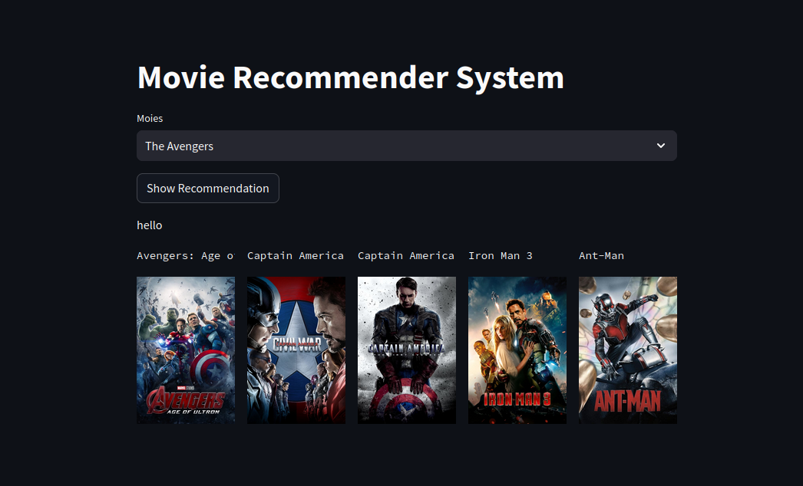

# Movie Recommender System - Python

This repository contains a Movie Recommender System implemented in Python, utilizing data from TMDb (The Movie Database). The system aims to provide personalized movie recommendations based on user preferences and historical data.

## Table of Contents

- [Introduction](#introduction)
- [Data Source](#data-source)
- [Features](#features)
- [Installation](#installation)
- [Usage](#usage)
- [Contributing](#contributing)
- [License](#license)

## Introduction

A movie recommender system is an application that suggests movies to users based on their past interactions with movies or their preferences. It utilizes various algorithms to analyze user behavior and movie characteristics to generate personalized recommendations.

This project implements a movie recommender system using Python and TMDb's movie dataset. It employs collaborative filtering techniques and content-based filtering to offer users movie suggestions they are likely to enjoy.

## Data Source

The dataset used for this project is sourced from TMDb (The Movie Database). TMDb is a popular online database that provides information about movies, TV shows, and celebrities. It offers an API to access its vast collection of movie-related data.

Please note that you need to obtain an API key and (dataset)[https://www.kaggle.com/datasets/tmdb/tmdb-movie-metadata?select=tmdb_5000_movies.csv] from TMDb to access their data. The API key should be kept secure and not shared publicly.

## Features

The Movie Recommender System offers the following features:

- Collaborative filtering: Recommends movies based on user-user and item-item similarity.
- Content-based filtering: Recommends movies similar to those a user has liked based on movie attributes.
- Personalized recommendations: Tailored movie suggestions based on individual user preferences.
- Top-rated movies: Provides a list of top-rated movies from the dataset.

## Installation

To set up the Movie Recommender System on your local machine, follow these steps:

1. Clone this repository to your local machine using `git clone https://github.com/alk-neq-me/movie-recommender-system-python.git`.
2. Navigate to the project directory: `cd movie-recommender-system-python`.
3. Install the required dependencies: `pip install -r requirements.txt`.

## Usage

To use the Movie Recommender System, follow these instructions:

1. Obtain a TMDb API key from [TMDb website](https://www.themoviedb.org/documentation/api).
2. Replace the placeholder for the API key in the `config.py` file with your actual API key.
3. Prepare the dataset by running the data collection script (if available).
4. Run the movie recommender system using the [Streamlit](https://discuss.streamlit.io/): `streamlit run app.py`.

## Contributing

Contributions to this movie recommender system are welcome. If you find any issues or have suggestions for improvement, please feel free to open an issue or submit a pull request.

## License

[Indicate the license under which you're releasing the code, e.g., MIT License, Apache License 2.0, etc.]

[Include any additional sections, such as Acknowledgments, References, etc., if necessary.]
